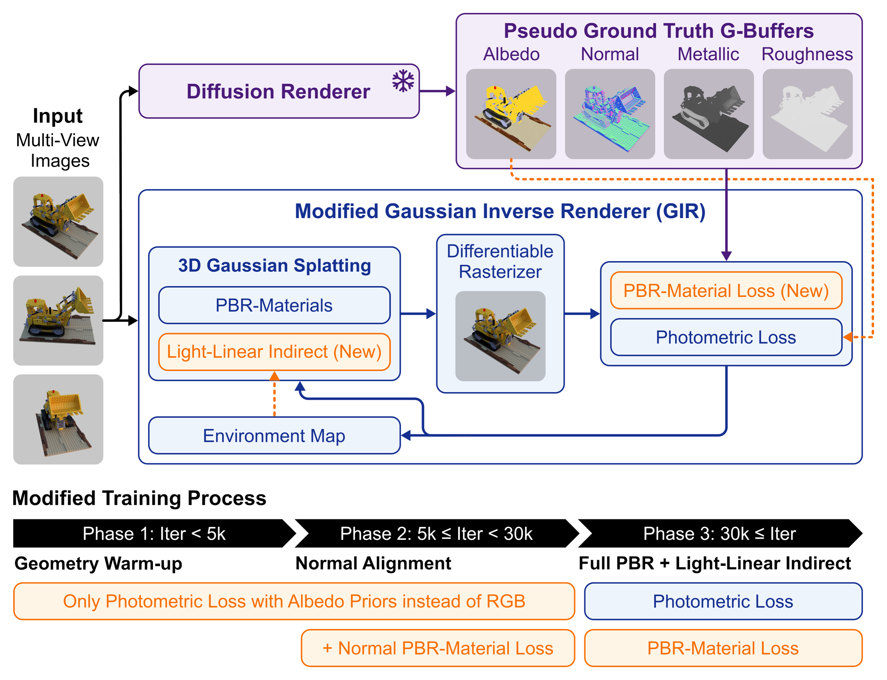

# 3D Gaussian Inverse Rendering with Diffusion Priors

This repository contains the official implementation of **3D Gaussian Inverse Rendering with Diffusion Priors**.

[](https://PuuTzzA.github.io/PBR-3DGS/)
[](https://PuuTzzA.github.io/PBR-3DGS/static/paper.pdf)
[](https://drive.google.com/file/d/1zN8qeiQoYxnl3pO4zo5Exqn2gCYzfl4z/view?usp=drive_link)

---

## Method Overview

<p align="center">
  
</p>

Our framework performs Physically Based Rendering (PBR) reconstruction and decomposition (Albedo, Normals, and Roughness) from multi-view images under unknown lighting conditions. By leveraging 2D Diffusion Priors, we constrain the inverse rendering problem, producing high-fidelity material parameters and enabling photorealistic novel-view synthesis and relighting under novel environment maps.

For a detailed mathematical description and technical breakdown of our pipeline, material model, and prior extraction techniques, please refer to [METHOD.md](METHOD.md).

---

## Setup (Short)

For the detailed environment installation and troubleshooting guide (compiling custom CUDA submodules, NumPy 2 compatibility, and PyTorch builds), see the [Detailed Setup Guide](SETUP.md).

### Quickstart

1. **Clone the repository recursively**:
   ```bash
   git clone --recursive --shallow-submodules https://github.com/PuuTzzA/PBR-3DGS.git
   cd PBR-3DGS
   ```

2. **Create and activate the environment**:
   ```bash
   conda env create -f environment.yml
   conda activate gir
   ```

3. **Install the custom CUDA submodules**:
   Please follow the compilation steps documented in [SETUP.md](SETUP.md) to successfully build `diff-gaussian-rasterization`, `simple-knn`, and `envlight` for your system configuration.

---

## Dataset Structure

The pipeline expects your datasets (including extracted priors) to follow a specific layout depending on their format (COLMAP real-world style vs. Blender/Synthetic style):

```text
<dataset_name>/
├── <Real_World_Dataset>/ (e.g., bicycle, garden)
│   ├── rgba/                   # Input images (or processed RGBA)
│   ├── albedo/                 # Estimated albedo maps
│   ├── albedo_video/           # Time-consistent video albedo maps
│   ├── depth/                  # Estimated depth maps
│   ├── normal/                 # Estimated surface normals
│   ├── metallic/               # Estimated metallic maps
│   ├── roughness/              # Estimated roughness maps
│   └── sparse/                 # COLMAP sparse camera poses (cameras/images/points)
│
└── <Synthetic_Dataset>/ (e.g., armadillo, lego)
    ├── hdris/                  # High-resolution HDRI environment maps (.hdr) for relighting
    ├── train/
    │   ├── rgba/               # Input images under base training lighting
    │   ├── rgba_<hdri_name>/   # GT relighted images for a specific HDRI (e.g., rgba_fireplace)
    │   ├── albedo/             # Estimated albedo prior
    │   ├── albedo_gt/          # Ground truth albedo
    │   ├── normal/             # Estimated normal prior
    │   ├── normal_gt/          # Ground truth normal
    │   └── ... (metallic, roughness, and depth priors)
    ├── val/                    # Similar structure to train
    ├── test/                   # Similar structure to train
    ├── transforms_train.json   # Camera poses for training
    ├── transforms_val.json     # Camera poses for validation
    └── transforms_test.json    # Camera poses for testing
```

*   **`hdris/`**: Stored `.hdr` files (e.g., `fireplace.hdr`, `night.hdr`, `snow.hdr`) containing high-resolution panoramic environment maps used during evaluation to relight the PBR-decomposed scene.
*   **`rgba_<hdri_name>/`**: Directories containing ground-truth reference images of the scene rendered under the corresponding HDRI (e.g., `rgba_fireplace/` corresponds to `fireplace.hdr`). The evaluation scripts load these folders to compute PSNR, SSIM, and LPIPS metrics under novel illumination.

---

## Running the Code

### 1. Training & Experiments
To train the model on a single scene dataset:
```bash
cd GIR
python train.py \
  -s /path/to/dataset \
  -m ./output_model \
  --eval \
  --port 6009
```

To run systematic experiment sets across various priors, baselines, and parameterizations:
```bash
# Run from the GIR directory
python run_experiments.py
```

### 2. Evaluation & Relighting
To evaluate the rendered novel views and calculate core image quality metrics (PSNR, SSIM, LPIPS):
```bash
# Run from the root directory
python evaluate_model.py --model_path ./GIR/output_model
```

To quantitatively evaluate the decomposed material parameters (Albedo, Normals, etc.):
```bash
python evaluate_materials.py --model_path ./GIR/output_model
```

To render relighted scenes using novel HDR environment maps:
```bash
python relight_all.py --model_path ./GIR/output_model --env_path /path/to/env_map.hdr
```

---

## GIR Baseline Integration
This codebase is developed as an extension of the Gaussian Inverse Rendering (GIR) framework. For details, licenses, and documentation specific to the base GIR codebase, please refer to the repository at [PuuTzzA/GIR](https://github.com/PuuTzzA/GIR).

---

## Acknowledgments
This repository builds upon [GIR](https://3dgir.github.io/) and leverages priors from [DiffusionRenderer](https://research.nvidia.com/labs/toronto-ai/DiffusionRenderer/). We thank the authors for their open-source contributions.